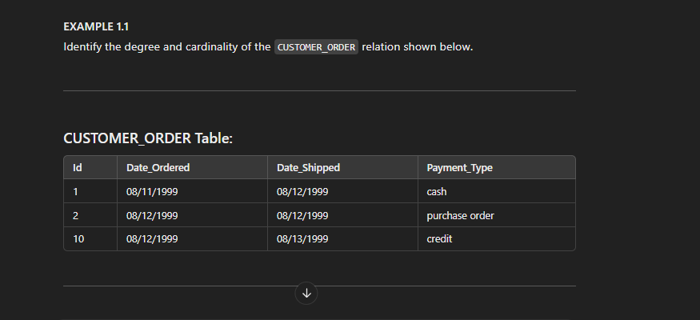

# SOFSQLP_E1.1

Identify the degree and cardinality of the CUSTOMER_ORDER relation shown below.

CUSTOMER_ORDER Table:
Id	Date_Ordered	Date_Shipped	Payment_Type
1	08/11/1999	08/12/1999	cash
2	08/12/1999	08/12/1999	purchase order
10	08/12/1999	08/13/1999	credit

Degree and Cardinality: 
Degree: 4 (because there are 4 attributes) 
Cardinality: 3 (because there are 3 rows) 